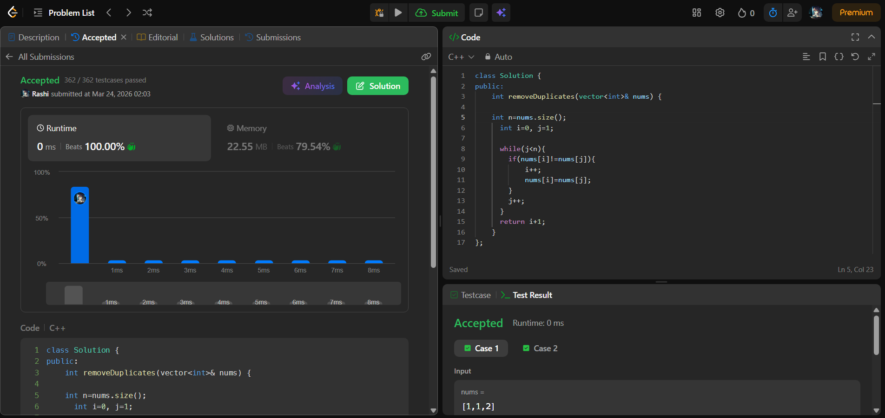

# Day 2 - POTD

## Problem Name:
REMOVE DUPLICATES FROM SORTED ARRAY

## Approach:
- Step 1: Two pointer approach will be followed
- Step 2: index i will point to the unique element and index j will track the unique element
- Step 3: Return the size of unique k elements of array.

## Screenshot:


## Code:
```cpp
#include <iostream>
using namespace std;

int main() {
    // your code here

   int removeDuplicates(vector<int>& nums) {

    int n=nums.size();
      int i=0, j=1;

      while(j<n){
        if(nums[i]!=nums[j]){
            i++;
            nums[i]=nums[j];
        }
        j++;
      }
      return i+1;
    }

}

//Time complexity: O(n)
//Space complexity: O(1).
