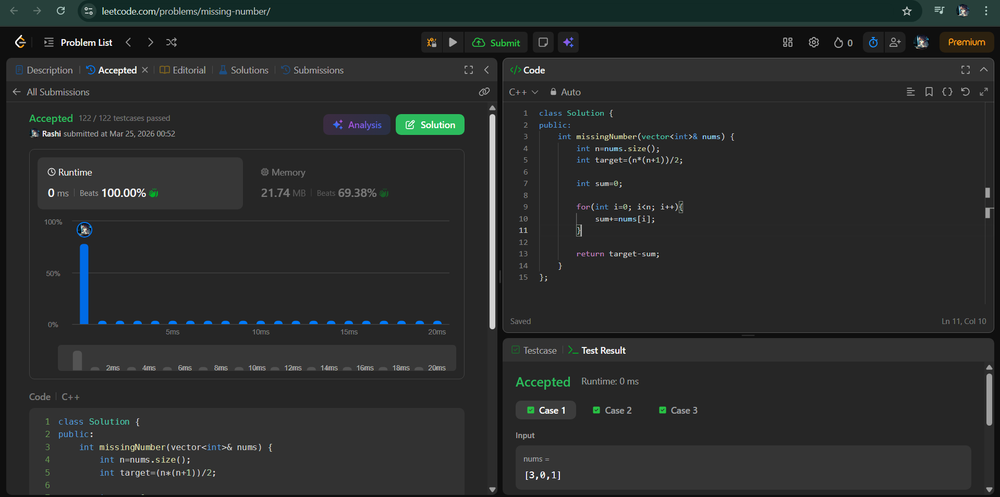

# Day 3 - POTD

## Problem Name:
Missing Number 

## Approach:
- Step 1: Use the formula for sum of first n natural numbers: n*(n+1)/2
- Step 2: Calculate the expected sum using formula
- Step 3: Calculate the actual sum of array elements
- Step 4: Missing number = expected sum - actual sum

## Screenshot:


## Code:
```cpp
#include <iostream>
using namespace std;
int main(){

int missingNumber(vector<int>& nums) {
        int n=nums.size();
        int target=(n*(n+1))/2;

        int sum=0;

        for(int i=0; i<n; i++){
            sum+=nums[i];
        }

        return target-sum;
    }
}
//Time Complexity:O(n)
//Space Complexity:O(1)
