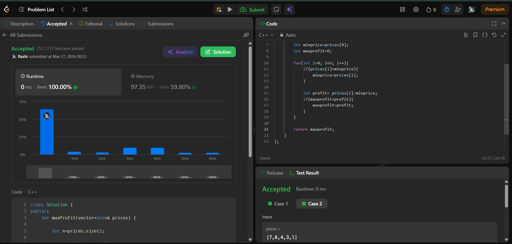

# Day 4 - POTD

## Problem Name:
Best Time to Buy and Sell Stock 

## Approach:
- Step 1: Initialize minimum price as first element
- Step 2: Traverse the array
- Step 3: At each step, calculate profit = current price - minimum price
- Step 4: Update maximum profit
- Step 5: Update minimum price if current price is smaller

## Screenshot:


## Code:
```cpp
#include <iostream>
using namespace std;

int main() {

    int maxProfit(vector<int>& prices) {

        int n=prices.size();
        int profit=0;
        for(int i=0; i<n; i++){
            for(int j=i+1; j<n; j++){
                if(prices[j]>prices[i]){
                    int diff=prices[j]-prices[i];
                    if(profit<diff){
                        profit=diff;
                    }
                }
            }
        }
    return profit;

    }
}

//TC: O(n2)
//SC:  O(1)

//Brute force..the logic is right but this will give TLE.

//Need optimised code

class Solution {
public:
    int maxProfit(vector<int>& prices) {

        int n=prices.size();
        
        int minprice=prices[0];
        int maxprofit=0;

        for(int i=0; i<n; i++){
            if(prices[i]<minprice){
                minprice=prices[i];
            }

            int profit= prices[i]-minprice;
            if(maxprofit<profit){
                maxprofit=profit;
            }
        }

        return maxprofit;
    }
};

//Optimised code using Greedy

//TC: O(n)
//SC: O(1)
