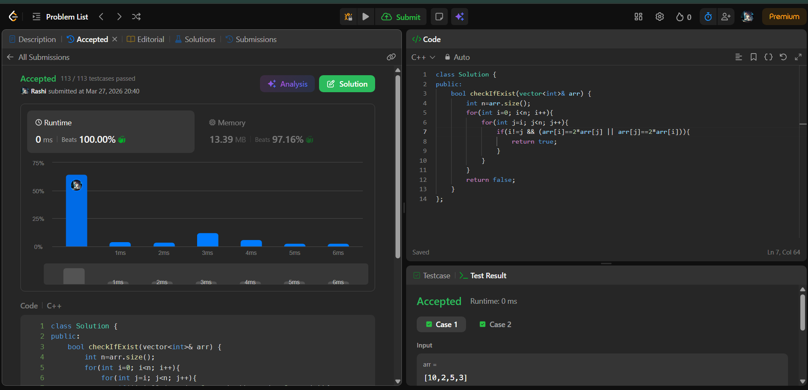

# Day 6 - POTD

## Problem Name:
Check If N and Its Double Exist 

## Approach:
- Step 2: Traverse the array
- Step 3: For each element x:
    - Check if all the condition satisfy for an element and it's double
- Step 4: If found, return true
- Step 5: Otherwise, return false

## Screenshot:


## Code:
```cpp
#include <iostream>
#include <vector>
using namespace std;

int main() {
    bool checkIfExist(vector<int>& arr) {
        int n=arr.size();
        for(int i=0; i<n; i++){
            for(int j=i; j<n; j++){
                if(i!=j && (arr[i]==2*arr[j] || arr[j]==2*arr[i])){
                    return true;
                }
            }
        }
        return false;
    }

    return 0;
}

//TC: O(n2)
//SC: O(1)
